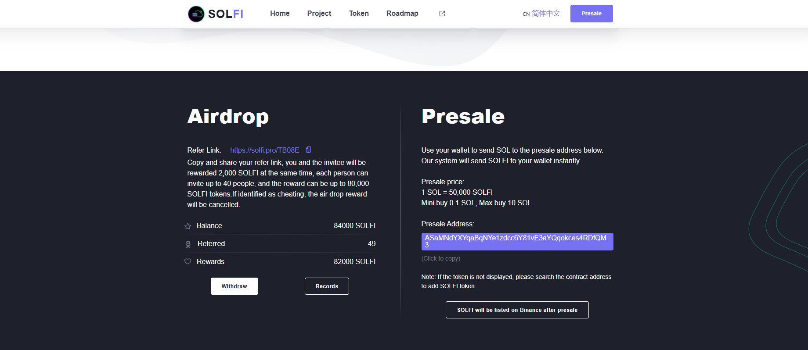

# Solfi Auto ref
- USE PROXY TO SIMULATE MULTIPLE DEVICES ON SOLFI AND EARN MORE TOKEN


**Nodepay AI** before start the script you must have account in [Solfi.pro](https://solfi.pro/TB08E)
- Register to Solfi: [Solfi.pro](https://solfi.pro/TB08E)
# WARNING
⚠️ "User assumes all responsibility and risk associated with the use of this bot/program script."
# How to run 
## clone the repository
```bash
git clone https://github.com/nongdancryptos/Solfi-Buff-Ref.git
cd Solfi-Buff-Ref
```
## install the requirements
```bash
npm install
```
```bash
node run.js ( if you have wallet address in wallet.txt )
```
```bash
 node run3.js ( generator random address )
```
# NOTE

- **Paste your proxies inside ```proxy.txt``` 

## Donations

If you would like to support the development of this project, you can make a donation using the following addresses:

- **Solana**: `3rYhoVL8g28iwjGQq8hKw4bvVmBGhyC8DEbKAwzmy4wn`
- **EVM**: `0x431588aff8ea1becb1d8188d87195aa95678ba0a`
- **BTC**: `bc1pu30mhlegcajqq23ff30vrlnlnsmv0ha6ufwaenv0em4ap8dfzyrqwsvjx5`

## Contributing

Feel free to open issues or submit pull requests if you have improvements or bug fixes.

## License

This project is licensed under the MIT License. See the [LICENSE](LICENSE) file for details.
